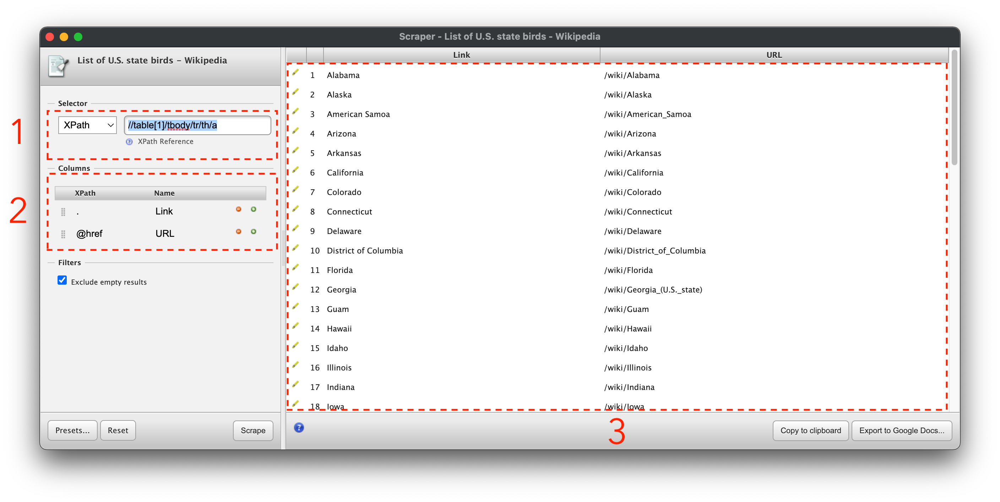
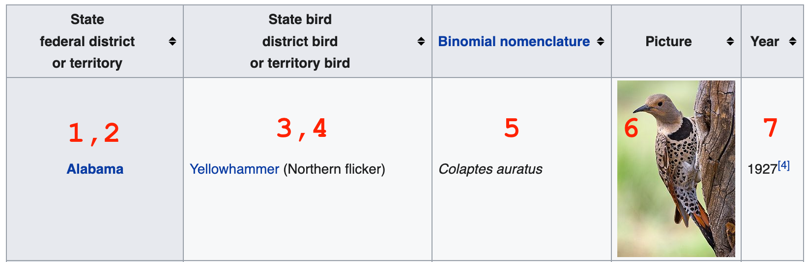
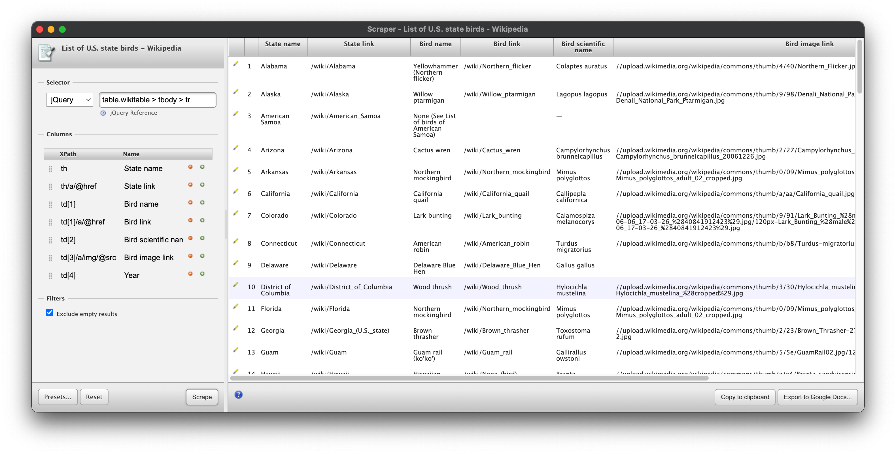

# Chrome Scraper Tool

To start, we won't be using Python at all. We'll be using a free browser extension for Google Chrome that I find helpful for scraping data from a single page of data that isn't friendly to copying and pasting.

The tool is called [Scraper](https://chrome.google.com/webstore/detail/scraper/mbigbapnjcgaffohmbkdlecaccepngjd), making it very difficult to find in the Chrome app store if you don't have that link.

In Chrome, with the tool installed, let's take a look at [US state birds](https://en.wikipedia.org/wiki/List_of_U.S._state_birds). Say you want to throw together a quick data viz about how many different states have the same state bird. Sometimes you can kind of copy and paste data from a table on a website to a spreadsheet, but it doesn't always work. In those cases, this scraper extension can save you some time, once you know how to use it.

## Scraper Interface

Start by right clicking on one of the state name links and clicking on the new "Scrape similar" option. You'll see something like this:



The Scraper interface has 3 main sections: the selector, the columns, and the preview pane.

The **selector** section (marked with a 1) lets you use an xpath or jquery selector to pick out a unit of data to serve as a row in your output spreadsheet.

The **columns** section (marked with a 2) uses xpath notation to select data for the columns of your spreadsheet. You can use the selector to select a container element in the page, and the xpath selectors in the columns section to select portions of that container that you want to record as attributes of whatever is in a row.

The **preview pane** (marked with a 3) shows what your output will look like from the selectors you've specified. I find copying this to my clipboard to be the most reliable way to use this data.

It may be helpful to you to to reference some cheat sheets for [css selectors](https://devhints.io/css) and for [xpath selectors](https://devhints.io/xpath). I'll note what each of the selectors we'll use does, but these are useful for general reference.

## Extracting Data

So what are we interested in in this table? We'll shoot for these:
1. State name
2. State link
3. Bird name
4. Bird link
5. Bird scientific name
6. Bird image link
7. Year when state bird was established



In this case, we can copy and paste the text of the table into a spreadsheet okay, but the links and other data won't come through as easily. Fortunately, it's not that hard to get them using Scraper.

Let's start by taking a look at the current selector:

    //table[1]/tbody/tr/th/a

That's just selecting the link in the row, but we want to scrape different info from each row. Let's try modifying the selector by removing everything after the row element, `tr`:

    //table[1]/tbody/tr

Then we can change our first column selector to `th` to get this **t**able **h**eader element and see what we get. Click "Scrape" below the columns to update the preview.

You may notice a bunch of extra junk at the bottom of the selector. That's because this selector is saying "Get any table that is the first element in its container, then get the body of the table, then get every row in that table body". It turns out that there are other tables inside of other containers on the page. We can try a more complex xpath expression, but instead, let's take the opportunity to articulate a jQuery expression, which uses CSS syntax. Change the selector type to jQuery, then use this selector:

    table.wikitable > tbody > tr

That's neater. That's because we're using a class selector, and selecting by class is easier to do in CSS-style selectors.

With rows neatly selected, we can start in on getting data from cells in each row. We already have a selector for the header:

    th

We want the link to the wiki page for the state as well, so we can use the `@href` selector to get that attribute of an `a` tag in our `th`:

    th/a/@href

The next thing we want is the name of the bird, which is in the first `td` element in the table. Xpath is good at selecting the *nth* element within another element, so we can just use this:

    td[1]

Update the preview to make sure everything worked. You should see something like this:


## Finishing the Scrape

With that, you should have the tools to select the rest of the data we've articulated. Try to extract the text from the other cells, as well as the image link for the picture of each state bird.

*Solution:*

```{toggle}
Selector
- `table.wikitable > tbody > tr` (jquery)

Columns
1. `th`
2. `th/a/@href`
3. `td[1]`
4. `td[1]/a/@href`
5. `td[2]`
6. `td[3]/a/img/@src`
7. `td[4]`


```
